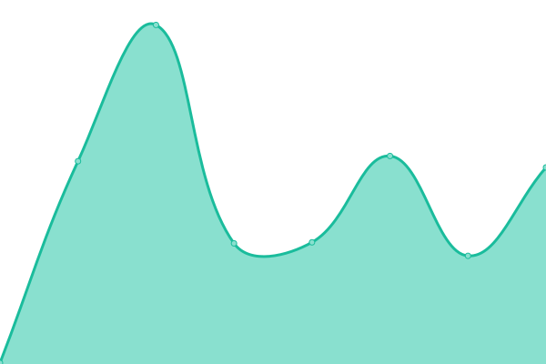
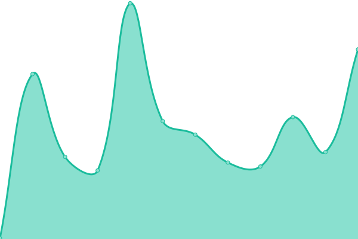
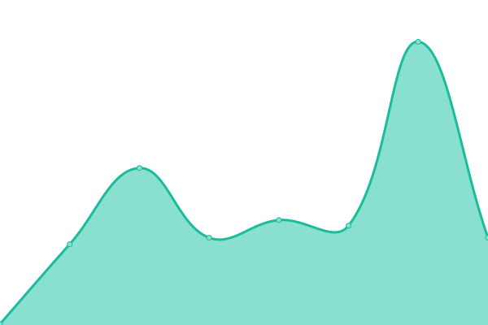

# [📈 Live Status](https://status.ihya.dev): <!--live status--> **🟧 Partial outage**

This repository contains the open-source uptime monitor and status page for [Mioscape](https://ihya.dev), powered by [Upptime](https://github.com/upptime/upptime).

With [Upptime](https://upptime.js.org), you can get your own unlimited and free uptime monitor and status page, powered entirely by a GitHub repository. We use [Issues](https://github.com/mioscape/mioscape-uptime-status/issues) as incident reports, [Actions](https://github.com/mioscape/mioscape-uptime-status/actions) as uptime monitors, and [Pages](https://status.ihya.dev) for the status page.

<!--start: status pages-->
<!-- This summary is generated by Upptime (https://github.com/upptime/upptime) -->
<!-- Do not edit this manually, your changes will be overwritten -->
<!-- prettier-ignore -->
| URL | Status | History | Response Time | Uptime |
| --- | ------ | ------- | ------------- | ------ |
|  [Main Homepage](https://ihya.dev/) | 🟩 Up | [main-homepage.yml](https://github.com/mioscape/mioscape-uptime-status/commits/HEAD/history/main-homepage.yml) | 

 233ms
     
 | 

<a href="https://status.ihya.dev/history/main-homepage">100.00%</a>
    

|  [Blog](https://blog.ihya.dev/) | 🟥 Down | [blog.yml](https://github.com/mioscape/mioscape-uptime-status/commits/HEAD/history/blog.yml) | 

 391ms
     
 | 

<a href="https://status.ihya.dev/history/blog">90.64%</a>
    

|  [VPN Subscription](https://subscription.ihya.dev/) | 🟩 Up | [vpn-subscription.yml](https://github.com/mioscape/mioscape-uptime-status/commits/HEAD/history/vpn-subscription.yml) | 

 168ms
     
 | 

<a href="https://status.ihya.dev/history/vpn-subscription">100.00%</a>
    

|  [Server Status](https://status.ihya.dev/) | 🟩 Up | [server-status.yml](https://github.com/mioscape/mioscape-uptime-status/commits/HEAD/history/server-status.yml) | 

 1199ms
     
 | 

<a href="https://status.ihya.dev/history/server-status">100.00%</a>
    

|  [ShitBin](https://shitbin.ihya.dev/) | 🟩 Up | [shit-bin.yml](https://github.com/mioscape/mioscape-uptime-status/commits/HEAD/history/shit-bin.yml) | 

 300ms
     
 | 

<a href="https://status.ihya.dev/history/shit-bin">100.00%</a>
    

|  [Music](https://music.ihya.dev/) | 🟩 Up | [music.yml](https://github.com/mioscape/mioscape-uptime-status/commits/HEAD/history/music.yml) | 

 176ms
     
 | 

<a href="https://status.ihya.dev/history/music">100.00%</a>
    

|  [Drive](https://drive.ihya.dev/) | 🟩 Up | [drive.yml](https://github.com/mioscape/mioscape-uptime-status/commits/HEAD/history/drive.yml) | 

 434ms
     
 | 

<a href="https://status.ihya.dev/history/drive">100.00%</a>
    

<!--end: status pages-->

[**Visit our status website →**](https://status.ihya.dev)

## 📄 License

- Powered by: [Upptime](https://github.com/upptime/upptime)
- Code: [MIT](./LICENSE) © [Mioscape](https://ihya.dev)
- Data in the `./history` directory: [Open Database License](https://opendatacommons.org/licenses/odbl/1-0/)
