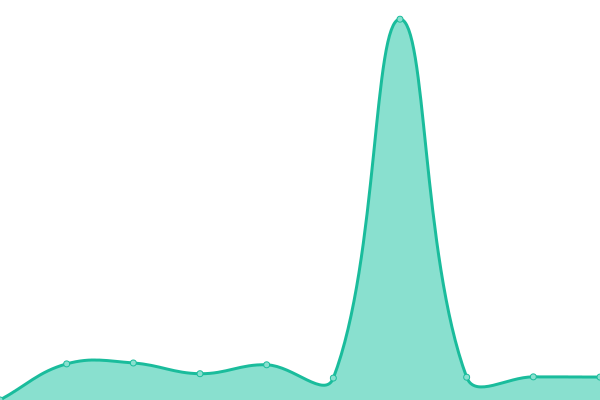

# [📈 Live Status](https://status.mioscape.my.id): <!--live status--> **🟧 Partial outage**

This repository contains the open-source uptime monitor and status page for [Mioscape](https://mioscape.my.id), powered by [Upptime](https://github.com/upptime/upptime).

With [Upptime](https://upptime.js.org), you can get your own unlimited and free uptime monitor and status page, powered entirely by a GitHub repository. We use [Issues](https://github.com/mioscape/mioscape-uptime-status/issues) as incident reports, [Actions](https://github.com/mioscape/mioscape-uptime-status/actions) as uptime monitors, and [Pages](https://status.mioscape.cf) for the status page.

<!--start: status pages-->
<!-- This summary is generated by Upptime (https://github.com/upptime/upptime) -->
<!-- Do not edit this manually, your changes will be overwritten -->
<!-- prettier-ignore -->
| URL | Status | History | Response Time | Uptime |
| --- | ------ | ------- | ------------- | ------ |
|  [Mioscape Homepage](https://ihyafauzi.my.id/) | 🟩 Up | [mioscape-homepage.yml](https://github.com/mioscape/mioscape-uptime-status/commits/HEAD/history/mioscape-homepage.yml) | 

 220ms
     
 | 

<a href="https://status.ihyafauzi.my.id/history/mioscape-homepage">66.63%</a>
    

|  [Mioscape Blog](https://blog.ihyafauzi.my.id/) | 🟩 Up | [mioscape-blog.yml](https://github.com/mioscape/mioscape-uptime-status/commits/HEAD/history/mioscape-blog.yml) | 

 186ms
     
 | 

<a href="https://status.ihyafauzi.my.id/history/mioscape-blog">66.63%</a>
    

|  [Mioscape VPN Subscription](https://subscription.mioscape.me/) | 🟩 Up | [mioscape-vpn-subscription.yml](https://github.com/mioscape/mioscape-uptime-status/commits/HEAD/history/mioscape-vpn-subscription.yml) | 

 130ms
     
 | 

<a href="https://status.ihyafauzi.my.id/history/mioscape-vpn-subscription">100.00%</a>
    

|  [Mioscape Server Status](https://status.ihyafauzi.my.id/) | 🟩 Up | [mioscape-server-status.yml](https://github.com/mioscape/mioscape-uptime-status/commits/HEAD/history/mioscape-server-status.yml) | 

 198ms
     
 | 

<a href="https://status.ihyafauzi.my.id/history/mioscape-server-status">66.63%</a>
    

|  [MioGang ShitBin](https://shitbin.miogang.tech/) | 🟩 Up | [mio-gang-shit-bin.yml](https://github.com/mioscape/mioscape-uptime-status/commits/HEAD/history/mio-gang-shit-bin.yml) | 

 299ms
     
 | 

<a href="https://status.ihyafauzi.my.id/history/mio-gang-shit-bin">100.00%</a>
    

|  [Mioscape DNS](https://dns.nextdns.io/4acb16/) | 🟥 Down | [mioscape-dns.yml](https://github.com/mioscape/mioscape-uptime-status/commits/HEAD/history/mioscape-dns.yml) | 

 454ms
     
 | 

<a href="https://status.ihyafauzi.my.id/history/mioscape-dns">100.00%</a>
    

|  [MioGang Drive](https://drive.ihyafauzi.my.id/) | 🟩 Up | [mio-gang-drive.yml](https://github.com/mioscape/mioscape-uptime-status/commits/HEAD/history/mio-gang-drive.yml) | 

 608ms
     
 | 

<a href="https://status.ihyafauzi.my.id/history/mio-gang-drive">66.63%</a>
    

<!--end: status pages-->

[**Visit our status website →**](https://status.mioscape.my.id)

## 📄 License

- Powered by: [Upptime](https://github.com/upptime/upptime)
- Code: [MIT](./LICENSE) © [Mioscape](https://mioscape.my.id)
- Data in the `./history` directory: [Open Database License](https://opendatacommons.org/licenses/odbl/1-0/)
